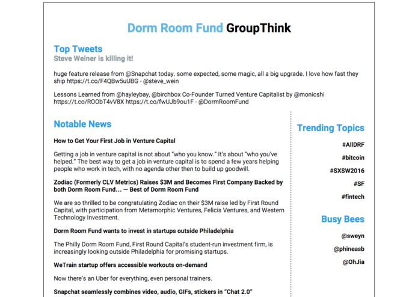

## GroupThink

GroupThink sources news articles and trending topics from a community of Twitter users, displaying the results in a weekly digest.

Check out the examples for [Dorm Room Fund](https://group-think-app.herokuapp.com/list/yasyf/dorm-room-fund), [KPCB Fellows](https://group-think-app.herokuapp.com/list/KPCBFellows/kpcb-fellows) and [MIT Students](https://group-think-app.herokuapp.com/list/MITstudents/mit-students).

HackPrinceton Spring 2016

